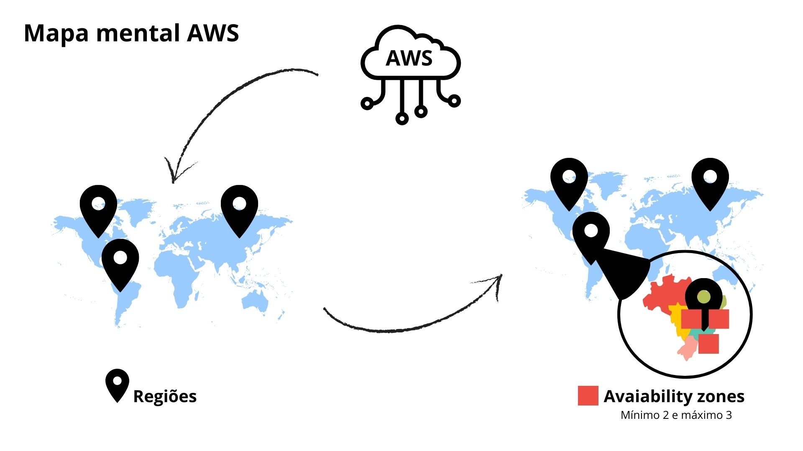
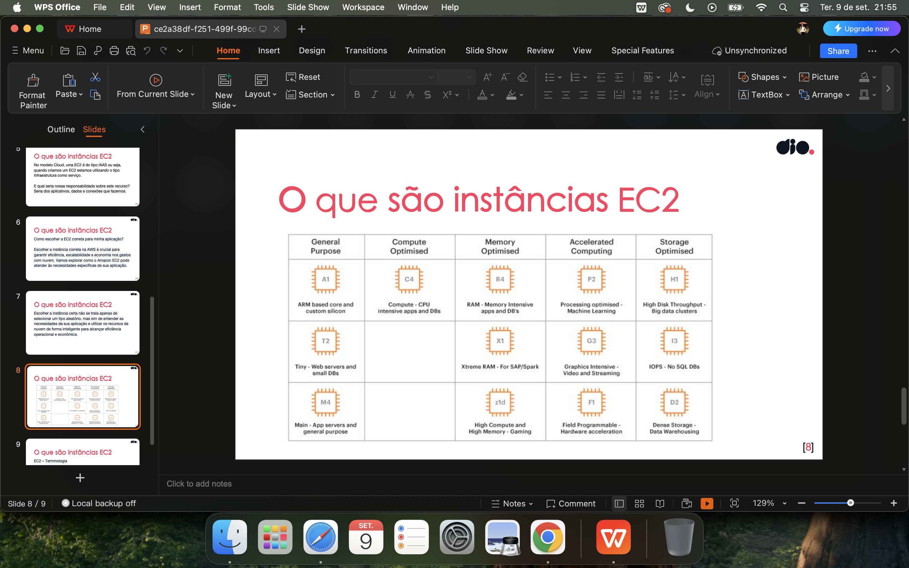
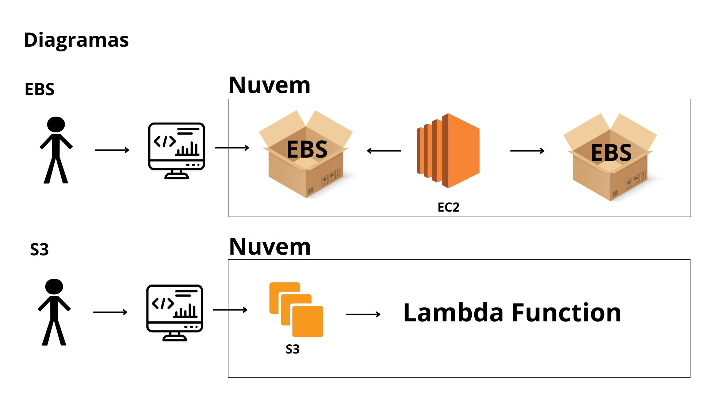

# Conhecimentos AWS curso
Desafio 1 do curso Code Girls

## AWS:
* Regiões - Regiões onde tem os avaiability zones
* Avaiability zones - Data centers independentes fisicamentem, mas conectados logicamente

### Modelos de núvem:
* Pública
* Híbrida
* Privada

### Modelos de serviços:
* SAAS - Software como serviço
* PAAS - Plataforma como serviço
* IAAS - Infraesfrutura como serviço

### Criar conta:
* Conta principal. Super usuário. Detém todos os poderes da conta
* Criar ela e depois IAMS, para nao ter risco de perder a conta

### IAM:
* Gerenciamento de identidade
* Criar perfis distintos para responsabilidades distintas
* Base para criar EC2

### Como criar recursos no AWS:
* Via portal
* Via Shell (linhas de comando)
* Via AWS CLI

### Segurança
* Perfis com responsabilidades diferentes
* Criar MFA (Autenticador multifatorial)

## EC2 - Máquina virtual da AWS

### Tipos de instancias:
* Sob demanda
* Spot ( mais barato, mas mais perigoso, porque pode ser cancelado em dois minutos)
* Reservado ( 1 a 3 anos)

### Aproveitamento de recursos
* Desligar EC2 que não estão sendo utilizadas
* Remover acessos ociosos
* Escalar recursos horizontalmente (número de recursos) e verticalmente (poder computacional)

  

## Armazenamento em nuvem

### Armazenamento EBS
* Como se fosse um HD Externo
* Armazenamento do EC2
* Necessário comprar para ter espaço de armazenamento nos ec2

### Armazenamento S3
* Armazenamento de objetos
* Armazena grande volume de dados

## Gerenciamento de instancias

### AMI
* Imagem de máquina virtual pré configurada
* Cópia de uma máquina virutal
* Backup

### Snapshot
* Captura de um determinado momento
* Backup

.jpg)

## Diagrama

